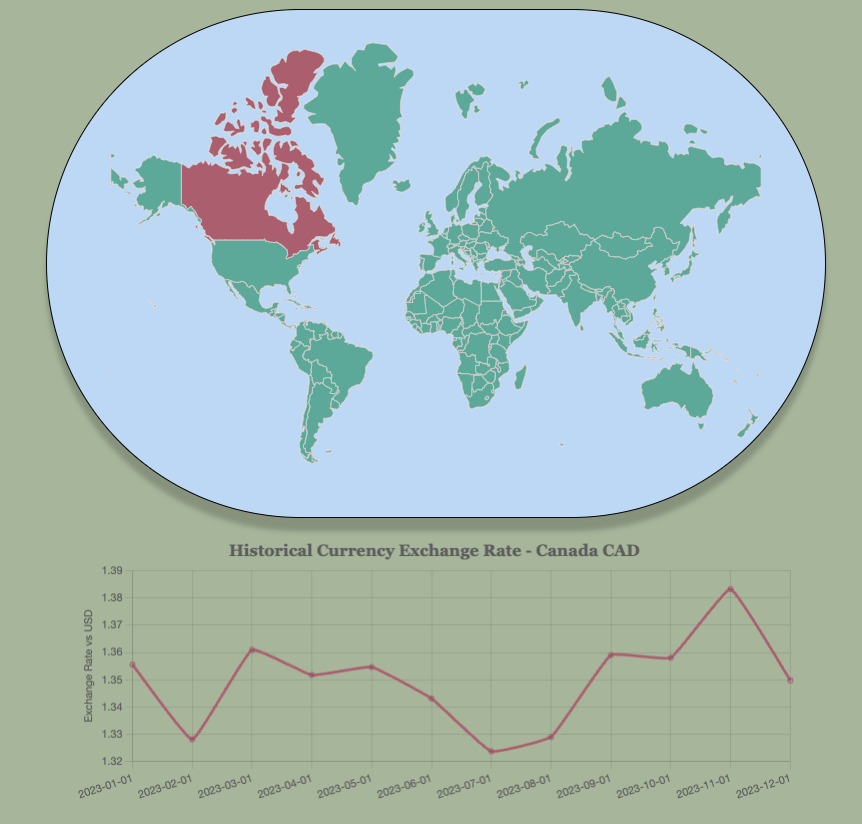

# Currency Exchange Visualizer


## Description
This is a web application that displays the historical currency exchange rate of a selected country compared to the U.S dollar. This was done using vanilla JavaScript and DOM manipulation.
[Live Demo](https://erklee.github.io/Currency_World/)

## Features

- **Interactive Map:** Click on a country on the map to select it for detailed analysis.

- **Dropdown Menu:** Use the dropdown menu to quickly navigate to a specific country.

- **Historical Chart:** Visualize historical currency exchange rates against the U.S dollar.

- **User-Friendly Interface:** Explore a world map with all countries shaded for a comprehensive overview.


## Example 


## Technologies, Libraries, APIs
The project will be implemented with the following technologies:

- HTML, CSS, JavaScript
- [D3](https://d3js.org/) Mapping library for world map visualization 
- [Chart.js](https://www.chartjs.org/) Charting library for exchange rate visualization
- [Currency Beacon](https://currencybeacon.com/)
Currency exchange rate API 


One of the features of the Currency Exchange Visualizer is the dropdown menu `#country-dropdown` is being populated based on the `currencyHash`
```javascript
  
      Object.keys(currencyHash).forEach((country) => {
        const option = document.createElement('option');
        option.value = country;
        option.innerHTML = country;
        dropdown.appendChild(option);
    })
  
...
  ```

There is asynchronous fetching of exchange rate date which ensures data is fetched before other operations happen

```javascript  dropdown.addEventListener('change', async function(){
        let country = dropdown.value;
        if (country === "" || selectedCountryPath) {
            selectedCountryPath.attr('fill', '#69b3a2');
            selectedCountryPath = null
        }

          try {
            let data = await Promise.all(dates.map(async date => {
            let result = await fetchExchangeRate(currency, date);
            return result;
            }));
            
          } catch (error) {
            console.error("Error fetching exchange rate data:", error.message);
      }
      });
```

When the mouse hovers over the country of the map the country will be highlited and will also display a tooltip with additional information about the country. The mouseout event will revert the color back to the default color as well as hiding the tooltip. On the click event i.e when a coutry is clicked it will update the selected country and changing the fill colors as well as execute other logic related to the event.

```javascript
countryPath
    .on('mouseover', function (event, d) {

        d3.select(this).attr('fill', '#b3697a');
        showTooltip(tooltip, event, feature.properties.name);
        })
    .on('mouseout', function (d) {
        d3.select(this).attr('fill', '#69b3a2');
        if(selectedCountryPath){
            selectedCountryPath.attr('fill', '#b3697a');
        }
        hideTooltip(tooltip);
        })
    .on('click', async function(event){
        let newCountryPath = d3.select(this);
    

        if (selectedCountryPath) {
            selectedCountryPath.attr('fill', '#69b3a2');

        }
        newCountryPath.attr('fill', '#b3697a');
        selectedCountryPath = newCountryPath;

```

The tooltip functionality is composed of three parts: `createTooltip`, `showTooltip` , `hideTooltip`. There are event listeners for the `mouseover` and `mouseout` events on the `countryPath`. When a user hovers over a country of the map, the associated country path changes its fill color to highlight the selection and the `showTooltip` function is called to display a tooltip containg the country's name. 


## Future Features
- Add a user input for a different base currency
- Compare the currency and show its purchaing power parity to other currencies
- Make the dates more dynamic
- Implement more API's for additional functions such as showing information about the selected country.
